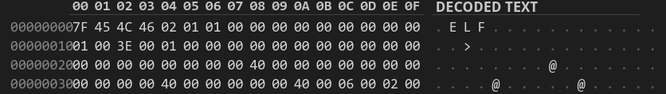

# Собираем свой **object elf64 file**
## Содержание

1. Краткое описание
2. Описание elf файла
   * Общее описание
   * Описание структуры объектного файла 
3. Структура elf header'а
4. Section header
   1. Структура section header'а
   2. Кратко о
      * .text
      * .shstrtab
      * .symtab
      * .strtab
      * .rela.text 
5. Symtab entry
6. Relatext entry
7. Заключение
8. Источники

## 1. Предисловие

В этом readme я опишу как собрать свой object elf64 file, способный линковаться с другими объектными файлами. Для этого мы будем использовать 5 секций: .text, .shstrtab, .symtab, .strtab, .rela.text.  

## 2. Описание elf файла в общем

### Общее описание:

ELF - формат двоичных файлов, используемый во многих современных UNIX-подобных операционных системах. По факту ELF задаёт стандарт, по которому файл линкуется с другими файлами, запускается операционной системой и прочее.

### Описание структуры объектного файла:

Общая структура нашего объектного файла такая:
* 64 байт ELF заголовка
* 64 байт байт нулевой секции (просто 64 байт нулей)
* 64 байт заголовка секции .text
* 64 байт заголовка секции .shstrtab
* 64 байт заголовка секции .symtab
* 64 байт заголовка секции .strtab
* 64 байт заголовка секции .rela.text
* 16 * N (N - натуральное число) байт исполняемого кода
* 16 * M (M - натуральное число) байт названий используемых заголовков секции - .shstrtab
* 16 * K (K - натуральное число) байт записей имён - .symtab 
* 16 * P (P - натуральное число) байт названий имён - .strtab
* 16 * Q (Q - натуральное число) байт записей реалокаций - .rela.text

## 3. Структура elf header'а

Опишем каждое поле:
* e_ident:
            
        sizeof(e_ident) = 16
        1-4 байты - ASCII-коды: '.', 'E', 'L', 'F'.
        5 байт  - для скольки битной системы был скомпилирован файл (0x02 - 64-битная система)
        6 байт - big endian или little endian порядки байт (0x01 - little endian)
        7 байт - версия ELF (у нас 0x01)
        8 байт - "специфичные для операционной системы или ABI расширения, используемые в файле" (у нас 0x00)
        Остальные байты зарезервированы и заполняются 0x00
* e_type:

        Тип ELF файла:
        1) 0x00 - неопределённый 
        2) 0x01 - объектный 
        3) 0x02 - исполняемый
        4) 0x03 - разделяемый объектный файл (PIE executable and shared lib)

* e_machine:
  
        Архитектура процессора 
        Наша архитектура - AMD64, поэтому берём из elf.h константу EM_X86_64, соответствующую значению 0x3e

*  e_version:

        Номер версии формата (у нас всегда 0x01)

* e_phoff:

        Program Header OFFset - смещение от начала файла до программных заголовков. 
        В объектных файлах программные секции отсутствуют, поэтому это поле заполняется 0x00.

* e_shoff:

        Section Header OFFset - смещение от начала файла до заголовков секций.

* e_flags:

        Флаги, зависящие от процессора.
        В стандартных случаях заполняется 0x00.

* e_ehsize:

        Размер заголовка ELF файла - 0x40

* e_phentsize:

        Program Header ENTry SIZE - размер программного заголовка (обычно 0x38 байт = 56 байт). 
        В объектных файлах программные секции отсутствуют, поэтому это поле заполняется 0x00.

* e_phnum:

        Program Header NUMber -  Количество программных заголовков

* e_shentsize:

        Section Header ENTry SIZE - размер заголовков секции (обычно 0x40 байт = 64 байт)

* e_shnum:

        Section Header NUMber - количество заголовков секции.

* e_shstrndx:

        Section Header STRing iNDex - индекс секции .shstrtab

Пример моего elf header'а:

## 4. Section header
### 1. Структура Section header'а

* sh_name:

        Индекс(символьный) названия данной секции в .strshtab

* sh_type:

        Тип секции:
        0) SHT_NULL - секция не используется
        1) SHT_PROGBITS - секция содержит информацию, определяемую самой программой
        2) SHT_SYMTAB - секция представляет таблицу символов(.symtab). Может быть только одна такая секция.
        3) SHT_STRTAB - секция представляет таблицу строк(.strtab). 
        4) SHT_RELA - секция содержит расширенную информацию о перемещениях

* sh_flags:

         Флаги секции:
         1) SHF_WRITE - в секцию можно записывать
         2) SHF_ALLOC - секция выгружается в оперативную память во время исполнения программы
         3) SHF_EXECINSTR - секция содержит исполняемый код

* sh_addr:

        Если раздел должен появиться в образе памяти процесса, то это поле указывает, начиная с какого байта, идёт эта секция.
        У нас это поле всегда будет равным 0x00.

* sh_offset:

        Смещение секции относительно начала файла.

* sh_size:

        Размер секции.

* sh_link и sh_info:
  
    Определяются следующей таблицей:
    

* sh_addralign:

        Выравнивание секции.

* sh_entsize:

        Размер каждой записи, если секция состоит из списка записей, иначе заполняется нулями.
 