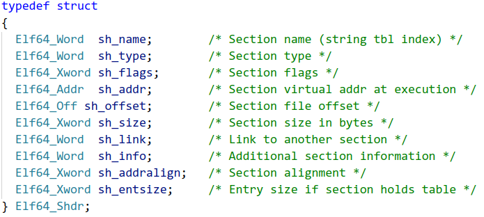
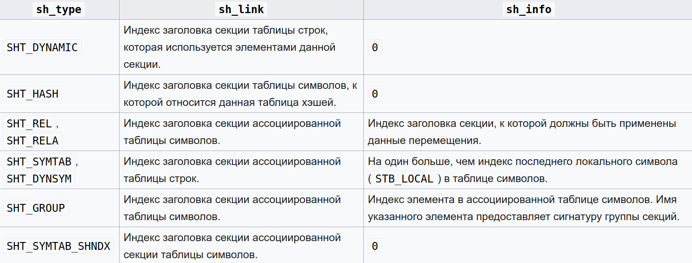
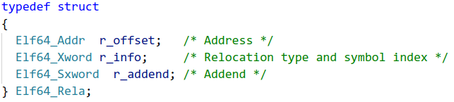

# Собираем свой **object elf64 file**
## Содержание

1. Краткое описание
2. Описание elf файла
   * Общее описание
   * Описание структуры объектного файла 
3. Структура elf header'а
4. Section
   1. Структура section header'а
   2. Кратко о секциях
      * .text
      * .shstrtab
      * .symtab
      * .strtab
      * .rela.text 
5. Symtab entry
6. Relatext entry
7. Заключение
8. Источники

## 1. Предисловие

В этом readme я опишу структуру object elf64 file, который будет способен линковаться с другими объектными файлами. Для этого мы будем использовать 5 секций: .text, .shstrtab, .symtab, .strtab, .rela.text.  

## 2. Описание elf файла в общем

### Общее описание:

ELF - формат двоичных файлов, используемый во многих современных UNIX-подобных операционных системах. По факту ELF задаёт стандарт, по которому файл линкуется с другими файлами, запускается операционной системой и прочее.

### Описание структуры объектного файла:

Общая структура нашего объектного файла такая:
* 64 байт ELF заголовка
* 64 байт байт нулевой секции (просто 64 байт нулей)
* 64 байт заголовка секции .text
* 64 байт заголовка секции .shstrtab
* 64 байт заголовка секции .symtab
* 64 байт заголовка секции .strtab
* 64 байт заголовка секции .rela.text
* 16 * N байт исполняемого кода
* 16 * M байт названий используемы
* 16 * K байт записей имён - .symtab 
* 16 * P байт названий имён - .strtab
* 16 * Q байт записей реалокаций - .rela.text

N, M, K, P, Q - натуральные числа

## 3. Структура elf header'а

Опишем каждое поле:
* e_ident:
            
        sizeof(e_ident) = 16
        1-4 байты - ASCII-коды: '.', 'E', 'L', 'F'.
        5 байт  - для скольки битной системы был скомпилирован файл (0x02 - 64-битная система)
        6 байт - big endian или little endian порядки байт (0x01 - little endian)
        7 байт - версия ELF (у нас 0x01)
        8 байт - "специфичные для операционной системы или ABI расширения, используемые в файле" (у нас 0x00)
        Остальные байты зарезервированы и заполняются 0x00.
* e_type:

        Тип ELF файла:
        1) 0x00 - неопределённый 
        2) 0x01 - объектный 
        3) 0x02 - исполняемый
        4) 0x03 - разделяемый объектный файл (PIE executable and shared lib)

* e_machine:
  
        Архитектура процессора.
        Наша архитектура - AMD64, поэтому берём из elf.h константу EM_X86_64, соответствующую значению 0x3e.

*  e_version:

        Номер версии формата (у нас всегда 0x01).

* e_phoff:

        Program Header OFFset - смещение от начала файла до программных заголовков. 
        В объектных файлах программные секции отсутствуют, поэтому это поле заполняется 0x00.

* e_shoff:

        Section Header OFFset - смещение от начала файла до заголовков секций.

* e_flags:

        Флаги, зависящие от процессора.
        В стандартных случаях заполняется 0x00.

* e_ehsize:

        Размер заголовка ELF файла - 0x40.

* e_phentsize:

        Program Header ENTry SIZE - размер программного заголовка (обычно 0x38 байт = 56 байт). 
        В объектных файлах программные секции отсутствуют, поэтому это поле заполняется 0x00.

* e_phnum:

        Program Header NUMber -  Количество программных заголовков.

* e_shentsize:

        Section Header ENTry SIZE - размер заголовков секции (обычно 0x40 байт = 64 байт)

* e_shnum:

        Section Header NUMber - количество заголовков секции.

* e_shstrndx:

        Section Header STRing iNDex - индекс секции .shstrtab.

## 4. Section header
### 1. Структура Section header'а

* sh_name:

        Индекс(символьный) названия данной секции в .strshtab.

* sh_type:

        Тип секции:
        0) SHT_NULL - секция не используется
        1) SHT_PROGBITS - секция содержит информацию, определяемую самой программой
        2) SHT_SYMTAB - секция представляет таблицу символов(.symtab). Может быть только одна такая секция.
        3) SHT_STRTAB - секция представляет таблицу строк(.strtab). 
        4) SHT_RELA - секция содержит расширенную информацию о перемещениях

* sh_flags:

         Флаги секции:
         1) SHF_WRITE - в секцию можно записывать
         2) SHF_ALLOC - секция выгружается в оперативную память во время исполнения программы
         3) SHF_EXECINSTR - секция содержит исполняемый код

* sh_addr:

        Если раздел должен появиться в образе памяти процесса, то это поле указывает, начиная с какого байта, идёт эта секция.
        У нас это поле всегда будет равным 0x00.

* sh_offset:

        Смещение секции относительно начала файла.

* sh_size:

        Размер секции.

* sh_link и sh_info:
  
    Определяются следующей таблицей:
    
    Для типов секций, которые не представлены в данной таблице, поля sh_link и sh_info заполняются нулями.

* sh_addralign:

        Выравнивание секции.

* sh_entsize:

        Размер каждой записи, если секция состоит из списка записей, иначе заполняется нулями.

### 2. Кратко о

* .text:

        В этой секции содержится исполняемый код. 
        Соответственно в заголовке поле sh_flags заполняется SHF_ALLOC | SHF_EXECINSTR, а поле sh_type = SHT_PROGBITS.

* .shstrtab:

        В этой секции содержатся символьные представления названий используемых в файле секций. После sh_type = SHT_STRTAB.

* .symtab:

        В этой секции находятся записи имён.
        Первая запись всегда нулевая.
        sh_type = SHT_SYMTAB.
        Подробнее о записях имён рассказано ниже.

* .strtab:

        В этой секции находятся символьные представления имён. 
        Например, здесь лежит название файла, название функций, переменный, меток и так далее.
        sh_type = SHT_STRTAB.

* .rela.text:

        В этой секции содержатся записи реалокаций. Они нужны для установления соответствия между определениями имён и ссылками на них.  
        Подробнее о записях реалокаций рассказано ниже.
        sh_type = SHT_RELA.

## 5. Symtab entry:

* st_name:

        Содержит индекс(символьный) в таблице строк. 

* st_info:

        4 бита отвечают на атрибут имени(st_bind), другие 4 бита за тип имени(st_type)
        Атрибуты, который мы будем использовать:
        1) STB_LOCAL - локальное имя, не будет виден за пределами объектного файла, в котором она представлена. Пример: переменные, локальные метки.
        2) STB_GLOBAL - глобальное имя, видимое для всех линкуемых объектных файлов. Пример: extern функции.
        Типы, которые мы будем использовать:
        1) STT_NOTYPE - тип имени не указывается
        2) STT_SECTION - имя связано с секцией.
        3) STT_FILE - имя соответствует пути к исходному файлу. При этом запись такого типа стоит перед всеми остальными записями имён. Индекс раздела (st_shndx) для него равен SHN_ABS.

* st_other:

        Область видимости, заданная в перемещаемом объекте, указывает правила обращения к имени, включенному в исполняемый или общий объектный файл.
        У нас это поле будет всегда иметь значение равно STV_DEFAULT = 0x00.

* st_shndx:

        Хранится индекс секции, с которой связана это имя.
        Например, если запись соответствует имени метки или функции, то здесь будет индекс на секцию .text, где находится определение этой функции.
        Для extern функций здесь стоит значение 0x00.
        В случае, если, например, запись соответствует константной переменной или имени файла, то здесь будет значение SHN_ABS = 0xfff1.

* st_value:

        Хранится значение имени. В зависимости от значений полей соответствующей записи это может быть абсолютное значение, адрес и прочее.
        Например, если у нас запись соответствует константной переменной, то здесь будет её значение. Если запись соответствует метке, то здесь будет её адрес в секции, имеющей индекс st_shndx, то есть в секции где была определена эта метка - .text.

* st_size:

        Со многими именами связан размер. Например, размер объекта данных - это число байт в объекте. Если размер имени не применяется или неизвестен, в этом элементе указано значение 0x00.
        У нас это поле всегда будет равным 0x00.

## 6. Relatext entry

(Пфф, всего лишь 3 поля, легко... Нет)
* r_offset:

        Адрес, куда нужно подставить значение. 
        Это значение может быть адресом функции, extern переменной. 

* r_info:

        Хранит в себе индекс таблицы имён (.symtab), по отношению к которому должно быть выполнено перемещение, и тип операции перемещения.
        Тип перемещения говорит линковщику, какие вычисления нужно производить с полями записи relatext, чтобы произвести перемещение.
        У нас для extern функций будет лежать значение R_X86_64_PC32 = 0x02. 

* r_addend:

        Задаёт константу, которую использует линковщик для того, чтобы произвести перемещение. 
        Для наших extern функций здесь лежит значение -0x04, представленное в дополнительном коде.

## 7. Заключение:

На основе описания этих структур данных, теперь можно начать писать свой объектный файл. Перед этим я рекомендую самому изучить elf64 file, сгенерированный компилятором nasm'a. Он создаёт относительно простой elf file, который вполне возможно разобрать самому. Также можно использовать утилиту readelf. Но это уже только после того, как вы сами разберёте один elf файл.

## 8. Источники:

* https://ru.wikipedia.org/wiki/Executable_and_Linkable_Format - на удивление достаточно хорошее содержание.
* http://www.regatta.cs.msu.su/doc/usr/share/man/info/ru_RU/a_doc_lib/aixprggd/genprogc/genprogc02.htm#ToC - представляет собой перевод документации System V Application Binary Interface
* http://www.sco.com/developers/gabi/2003-12-17/contents.html - документация System V Application Binary Interface