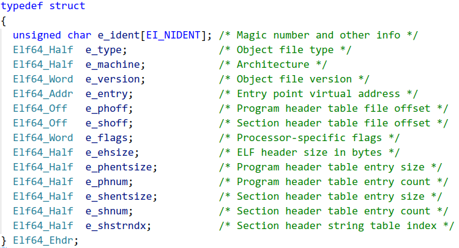
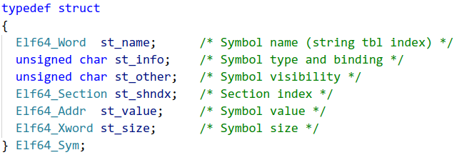

# Собираем свой **object elf64 file**
## Содержание

- [Собираем свой **object elf64 file**](#собираем-свой-object-elf64-file)
  - [Содержание](#содержание)
  - [1. Предисловие](#1-предисловие)
  - [2. Описание elf файла](#2-описание-elf-файла)
    - [Общее описание:](#общее-описание)
    - [Описание структуры объектного файла](#описание-структуры-объектного-файла)
  - [3. Структура elf header'а](#3-структура-elf-headerа)
    - [Разбор каждого поля](#разбор-каждого-поля)
    - [Пример elf header'а](#пример-elf-headerа)
  - [4. Section header](#4-section-header)
    - [1. Структура Section header'а](#1-структура-section-headerа)
    - [2. Пример section header'а](#2-пример-section-headerа)
      - [**header для .symtab**](#header-для-symtab)
      - [**header для .rela.text**](#header-для-relatext)
    - [3. Кратко об используемых секциях](#3-кратко-об-используемых-секциях)
  - [5. Symtab entry](#5-symtab-entry)
    - [Разбор каждого поля symtab entry](#разбор-каждого-поля-symtab-entry)
    - [Разбор имен в таблице символов](#разбор-имен-в-таблице-символов)
  - [6. Relatext entry](#6-relatext-entry)
    - [Разбор каждого поля relatext entry](#разбор-каждого-поля-relatext-entry)
    - [Пример записи реалокации](#пример-записи-реалокации)
  - [7. Заключение:](#7-заключение)
  - [8. Источники:](#8-источники)

## 1. Предисловие

В этом readme я опишу структуру object elf64 file, который будет способен линковаться с другими объектными файлами. Для этого мы будем использовать 5 секций: .text, .shstrtab, .symtab, .strtab, .rela.text. 
Примеры мы будем брать с этой программы, скомпилированной компилятором nasm:

Этот исходник, а также его скомпилированная версия хранятся в res/examples

## 2. Описание elf файла

### Общее описание:

ELF - формат двоичных файлов, используемый во многих современных UNIX-подобных операционных системах. По факту ELF задаёт стандарт, по которому файл линкуется с другими файлами, запускается операционной системой и прочее.

### Описание структуры объектного файла

Общая структура нашего объектного файла такая:
* 64 байт ELF заголовка
* 64 байт байт нулевой секции (просто 64 байт нулей)
* 64 байт заголовка секции .text
* 64 байт заголовка секции .shstrtab
* 64 байт заголовка секции .symtab
* 64 байт заголовка секции .strtab
* 64 байт заголовка секции .rela.text
* 16 * N байт исполняемого кода
* 16 * M байт названий используемых заголовков секции - .shstrtab
* 16 * K байт записей имён - .symtab 
* 16 * P байт названий имён - .strtab
* 16 * Q байт записей реалокаций - .rela.text

N, M, K, P, Q - натуральные числа.

На самом деле сами секции могут идти в любом порядке, линковщику это неважно, так как он сможет сам разобраться и однозначно сопоставить заголовки соответствующих секций. Но мы для простоты восприятия будем заполнять объектный файл в порядке изложенном выше.
Заметим, что **заголовки секций** должны идти непрерывно, так как они представляют собой *массив секций*.
Также, когда я буду говорить про *индекс секции* без уточнения *"(символьный)"*, я буду иметь в виду в каком порядке у нас в *elf файле* идёт эта секция. Например, индекс секции .symtab в нашем elf файле будет 3. Когда я буду говорить *индекс(символьный) секции* я буду иметь в виду индекс в секции .shstrtab.
Не бойтесь, если вам сейчас ничего непонятно, ниже я постараюсь всё объяснить. Главное не спешить.

## 3. Структура elf header'а
### Разбор каждого поля

Опишем каждое поле:
* e_ident:
            
        sizeof(e_ident) = 16
        1-4 байты - ASCII-коды: '.', 'E', 'L', 'F'.
        5 байт  - для скольки битной системы был скомпилирован файл (0x02 - 64-битная система)
        6 байт - big endian или little endian порядки байт (0x01 - little endian)
        7 байт - версия ELF (у нас 0x01)
        8 байт - "специфичные для операционной системы или ABI расширения, используемые в файле".
        Если никаких расширений не используется, то это байт равен значению ELFOSABI_NONE = 0.
        Остальные байты зарезервированы и заполняются 0x00.
* e_type:

        Тип ELF файла:
        1) 0x00 - неопределённый 
        2) 0x01 - объектный 
        3) 0x02 - исполняемый
        4) 0x03 - разделяемый объектный файл (PIE executable and shared lib)

* e_machine:
  
        Архитектура процессора.
        Наша архитектура - AMD64, поэтому берём из elf.h константу EM_X86_64, соответствующую значению 0x3e.

*  e_version:

        Номер версии формата (у нас всегда 0x01).

* e_entry:

        Адрес выполняемого кода при его загрузке в оперативную память.
        Для объектных файлов это поле заполняется нулями.

* e_phoff:

        Program Header OFFset - смещение от начала файла до программных заголовков. 
        В объектных файлах программные секции отсутствуют, поэтому это поле заполняется 0x00.

* e_shoff:

        Section Header OFFset - смещение от начала файла до заголовков секций.

* e_flags:

        Флаги, зависящие от процессора.
        В стандартных случаях заполняется 0x00.

* e_ehsize:

        Размер заголовка ELF файла - 0x40.

* e_phentsize:

        Program Header ENTry SIZE - размер программного заголовка (обычно 0x38 байт = 56 байт). 
        В объектных файлах программные секции отсутствуют, поэтому это поле заполняется 0x00.

* e_phnum:

        Program Header NUMber -  Количество программных заголовков.

* e_shentsize:

        Section Header ENTry SIZE - размер заголовков секции (обычно 0x40 байт = 64 байт)

* e_shnum:

        Section Header NUMber - количество заголовков секции.

* e_shstrndx:

        Section Header STRing iNDex - индекс секции .shstrtab.

### Пример elf header'а
Посмотрим, как будет выглядеть заголовок для нашей программы из предисловия:

        При чтение заголовка не забываем, что все байты расположены в little endian порядке.
        Первые 16 байт нам говорят, что наш файл - elf файл, был скомпилирован для 64-битной системы,
        с порядком байт little endian, версией формата 1, без специфических расширений.
        Тип elf файла - объектный.
        Архитектура процессора, для которой был скомпилирован elf файл AMD64.
        номер версии формата 1.
        Адрес выполняемого кода - 0x00 (у нас объектный файл).
        Смещение программных заголовков - 0x00 (у нас объектный файл, программные заголовки только в исполняемых файлах).
        Смещение заголовков секции - 0x40.
        Специфических флагов не указано - 0x00.
        Размер elf заголовка - 0x40.
        Размер программного заголовка - 0x00 (у нас объектный файл).
        Количество программных заголовков - 0x00 (у нас объектных файл)
        Размер заголовка секции - 0x40. 
        Количество заголовков секции (включая нулевой заголовок) - 0x00.
        Индекс секции .shstrtab - 0x02.

## 4. Section header
### 1. Структура Section header'а

* sh_name:

        Индекс(символьный) названия данной секции в .strshtab.

* sh_type:

        Тип секции:
        0) SHT_NULL - секция не используется
        1) SHT_PROGBITS - секция содержит информацию, определяемую самой программой
        2) SHT_SYMTAB - секция представляет таблицу символов(.symtab). Может быть только одна такая секция.
        3) SHT_STRTAB - секция представляет таблицу строк(.strtab). 
        4) SHT_RELA - секция содержит расширенную информацию о перемещениях

* sh_flags:

         Флаги секции:
         1) SHF_WRITE - в секцию можно записывать
         2) SHF_ALLOC - секция выгружается в оперативную память во время исполнения программы
         3) SHF_EXECINSTR - секция содержит исполняемый код

* sh_addr:

        Если раздел должен появиться в образе памяти процесса, то это поле указывает, 
        начиная с какого байта, идёт эта секция.
        У нас это поле всегда будет равным 0x00.

* sh_offset:

        Смещение секции относительно начала файла.

* sh_size:

        Размер секции.

* sh_link и sh_info:
  
    #### Определяются следующей таблицей:
    
    Для типов секций, которые не представлены в данной таблице, поля sh_link и sh_info заполняются нулями.

* sh_addralign:

        Выравнивание секции в elf файле.

* sh_entsize:

        Размер каждой записи, если секция состоит из записей, иначе заполняется нулями.

### 2. Пример section header'а
Пример взят из res/examples/example.o

Рассмотрим два самых непростых section header'а: 
* header для .symtab 
* header для .rela.text

#### **header для .symtab**

* sh_name: 0x0100 - 0x0103 байты:

        Индекс(символьный) строкового представления названия нашей секции в секции .shstrtab - 0x11.
        Смотрим на эту секцию:

**.shstrtab**

        Да, действительно, не обманули. 
        Указан верный индекс(символьный), указывающий на название рассматриваемой секции - .symtab.

*  sh_type: 0x0104 - 0x0107 байты:

        Тип секции 0x02, что соответствует типу секции SHT_SYMTAB. 

* sh_flags: 0x0108 - 0x010F байты:

        У секции нет никаких флагов - 0x00.

* sh_addr: 0х110 - 0х117 байты:

        Секция не выгружается в память, поэтому значение там 0x00.

* sh_offset: 0x0118 - 0x11F байты:

        Смещение секции от начала elf файла равно 0x0220(не забываем, что у нас little endian порядок байтов!).
        Давайте посмотрим, что у нас находится по этому адресу:

        Действительно, похоже на .symtab секцию... По крайней мере будет верить, что компилятор nasm'а нас не обманул.
        (Весьма понятно, что не обманул; с содержанием этой секцией мы ознакомимся ниже). 

* sh_size: 0x120 - 0x0127 байты:

        Размер содержимого рассматриваемой секции - 0xA8. Ok.

* sh_link: 0x0128 - 0x012B байты:

        sh_link = 0x04. Для того, чтобы осознать, что значит это число вернёмся к таблице для sh_link и sh_info. 
        (ссылка ниже)
        Это значит, что секция .symtab связана (ассоциирована) с секцией .strtab, то есть, 
        например, строковые представления имён будут браться из секции .strtab.

[Таблица для sh_link и sh_info](#определяются-следующей-таблицей) 

* sh_info: 0x012C - 0x012F байты:

        sh_info = 0x04. Это значит, что индекс на первое глобальное имя - 4.
        Значит, подразумевается, что все предыдущие имена в таблице символов должны иметь локальный тип.

* sh_addralign: 0х0130 - 0x0137 байты:

        Выравниваем секцию по количеству байт кратное 8 байтам

* sh_entsize: 0х0138 - 0x013F байты:

        Так как секция symtab состоит из записей, то это поле имеет ненулевое значение равное 0x18 = 24 байтам.
        Заметим, что, зная sh_size и sh_entsize, мы можем вычислить количество записей в таблице символов:
        0xA8 / 0x18 = 168 / 24 = 7, значит в таблице символов представлено 7 записей имён(включая нулевую запись).
        Весьма понятно, что sh_size должно нацело делиться на sh_entsize.

#### **header для .rela.text**

Повторяться с .symtab не будем, остановимся на том, что мне показалось более всего непонятным

* sh_link: 0x01A8 - 0x01AB байты:

        sh_link = 0x03. Значит, что секция .rela.text связана (ассоциирована) с секцией с индексом 3, 
        в нашем случае по этому индексу находится секция .symtab. С помощью этой секции линковщик будет понимать, 
        какие функции он линкует.

* sh_info: 0x01AC - 0x01AF байты:

        sh_info = 0x01. То есть реалокации должны быть применены к секции с индексом 1 - .text

Секцию .rela.text также называют таблицей перемещений.

### 3. Кратко об используемых секциях

* .text:

        В этой секции содержится исполняемый код. 
        Соответственно в заголовке поле sh_flags заполняется SHF_ALLOC | SHF_EXECINSTR, 
        а поле sh_type = SHT_PROGBITS.

* .shstrtab:

        В этой секции содержатся символьные представления названий используемых в файле секций. 
        После sh_type = SHT_STRTAB.

* .symtab:

        В этой секции находятся записи имён.
        Первая запись всегда нулевая.
        sh_type = SHT_SYMTAB.
        Подробнее о записях имён рассказано ниже.

* .strtab:

        В этой секции находятся символьные представления имён. 
        Например, здесь лежит название файла, название функций, переменных, меток и так далее.
        sh_type = SHT_STRTAB.

* .rela.text:

        В этой секции содержатся записи реалокаций. 
        Они нужны для установления соответствия между определениями имён и ссылками на них.  
        Подробнее о записях реалокаций рассказано ниже.
        sh_type = SHT_RELA.

## 5. Symtab entry
### Разбор каждого поля symtab entry

* st_name:

        Содержит индекс(символьный) в таблице строк. 

* st_info:

        4 бита отвечают на атрибут имени(st_bind), другие 4 бита за тип имени(st_type)
        
        Атрибуты, который мы будем использовать:
        1) STB_LOCAL - локальное имя, не будет виден за пределами объектного файла, в котором она представлена. 
        Пример: переменные, локальные метки.
        2) STB_GLOBAL - глобальное имя, видимое для всех линкуемых объектных файлов.
        Пример: extern функции.

        Типы, которые мы будем использовать:
        1) STT_NOTYPE - тип имени не указывается
        2) STT_SECTION - имя связано с секцией.
        3) STT_FILE - имя соответствует пути к исходному файлу. 
        При этом запись такого типа стоит перед всеми остальными записями имён. 
        Индекс раздела (st_shndx) для него равен SHN_ABS.

* st_other:

        Область видимости, заданная в перемещаемом объекте, 
        указывает правила обращения к имени, включенному в исполняемый или общий объектный файл.
        У нас это поле будет всегда иметь значение равно STV_DEFAULT = 0x00.

* st_shndx:

        Хранится индекс секции, с которой связано это имя.
        Например, если запись соответствует имени метки или функции, 
        то здесь будет индекс на секцию .text, где находится определение этой функции.
        Для extern функций здесь стоит значение 0x00.
        В случае, если, например, запись соответствует константной переменной или имени файла, 
        то здесь будет значение SHN_ABS = 0xfff1.

* st_value:

        Хранится значение имени. 
        В зависимости от значений полей соответствующей записи это может быть абсолютное значение, адрес и прочее.
        Например, если у нас запись соответствует константной переменной, то здесь будет её значение. 
        Если запись соответствует метке, то здесь будет её адрес в секции, имеющей индекс st_shndx, 
        то есть в секции где была определена эта метка - .text.

* st_size:

        Со многими именами связан размер. 
        Например, размер объекта данных - это число байт в объекте. 
        Если размер имени не применяется или неизвестен, в этом элементе указано значение 0x00.
        У нас это поле всегда будет равным 0x00.

### Разбор имен в таблице символов

Таблица символов, как уже разобрали, находится в elf файле со смещением 0x0220:

1) Первая запись нулевая, просто 24 байта нулей

2) Вторая запись всегда - запись имени файла
   

* st_name: 0x00 - 0x03 байты: 
 
        Строковое представление имени находится по индексу 1 в таблице строк .strtab. 
        Давайте проверим:

**.strtab**
   

        Наше название файла test.nasm. Не обманули.

 * st_info: 0x04 байт:
   * st_bind: первые 4 бита:
        
        STB_LOCAL = 0x00. Навзание файла не выходит за пределы нашего объектника.
     
   * st_type: вторые 4 бита:

        STT_FILE = 0x04. Тип записи - файл. Логично.
     
 * st_other: 0x05 байт: 

        STV_DEFAULT = 0x00. Стандартная область видимости. 
        Такое значение будет у всех записей имён.
     
 * st_shndx: 0x06 - 0x07 байты:

        st_shndx = 0xfff1. Это константа всегда указывается для записи файла. 
   
 * st_value: 0x08 - 0x0F байты:
   
        st_value = 0. Запись файла не имеет ни адреса, ни абсолютного значения.

 * st_size: 0x10 - 0x18:

        Размер имени нигде не применяется, следовательно оно равно 0.

3) Третья запись по-разному(как и остальные далее), но у нас эта запись секции

* st_name: 0x00 - 0x03 байты: 
 
        Секция не имеет символьного представления в .strtab. Поэтому здесь лежат нули.

 * st_info: 0x04 байт:
   * st_bind: первые 4 бита:
        
        STB_LOCAL = 0x00. Секция не выходит за пределы нашего объектника.
     
   * st_type: вторые 4 бита:

        STT_SECTION = 0x03. Тип записи - секция.
     
 * st_other: 0x05 байт: 

        STV_DEFAULT = 0x00. Стандартная область видимости. 
        Такое значение будет у всех записей имён.
     
 * st_shndx: 0x06 - 0x07 байты:

        st_shndx = 1. Запись представляет секцию .text
   
 * st_value: 0x08 - 0x0F байты:
   
        st_value = 0. Запись секции не имеет ни адреса, ни абсолютного значения.

 * st_size: 0x10 - 0x18:

        Размер имени нигде не применяется, следовательно оно равно 0.

4) Рассмотрим запись, представляющую запись локальной имени, например, локальной функции.

 * st_name: 0x00 - 0x03 байты: 
 
        st_name = 0x1D. Смотрим в таблицу строк и видим, что нам указывают на имя foo. 

 * st_info: 0x04 байт:
   * st_bind: первые 4 бита:
        
        STB_LOCAL = 0x00. Функция не выходит за пределы нашего объектника - она локальная.
     
   * st_type: вторые 4 бита:

        STT_NOTYPE = 0x00. У функции тип имени не указывается.
     
 * st_other: 0x05 байт: 

        STV_DEFAULT = 0x00. Стандартная область видимости. 
        Такое значение будет у всех записей имён.
     
 * st_shndx: 0x06 - 0x07 байты:

        st_shndx = 1. Это говорит нам, что рассматриваемая запись представлена в секциии .text.
   
 * st_value: 0x08 - 0x0F байты:
   
        st_value = 0x1E. Адрес относительно секции .text. 
        По этому адресу начинается наша функция foo в секции .text

 * st_size: 0x10 - 0x18:

        Размер имени нигде не применяется, следовательно оно равно 0.

5) Перейдем к записи extern функции.

* st_name: 0x00 - 0x03 байты: 
 
        st_name = 0x0B. Смотрим в таблицу строк и видим, что нам указывают на имя _print. 

 * st_info: 0x04 байт:
   * st_bind: первые 4 бита:
        
        STB_GLOBAL = 0x01. Наша функция глобальная. Её видят другие объектники при линковке. 
        Логично.
     
   * st_type: вторые 4 бита:

        STT_NOTYPE = 0x00. У функции тип имени не указывается.
     
 * st_other: 0x05 байт: 

        STV_DEFAULT = 0x00. Стандартная область видимости. 
        Такое значение будет у всех записей имён.
     
 * st_shndx: 0x06 - 0x07 байты:

        st_shndx = 0. Это говорит нам, что рассматриваемая запись не представлена ни в одной секции.
   
 * st_value: 0x08 - 0x0F байты:
   
        st_value = 0x00. Extern функция не имеет адреса, где бы она была бы определена.

 * st_size: 0x10 - 0x18:

        Размер имени нигде не применяется, следовательно оно равно 0.

## 6. Relatext entry
### Разбор каждого поля relatext entry

(Пфф, всего лишь 3 поля, легко... Нет)
* r_offset:

        Адрес относительно секции .text, куда нужно подставить значение. 
        Это значение может быть адресом функции, extern переменной. 

* r_info:

        Хранит в себе индекс имени в symtab, по отношению к которому должно быть выполнено перемещение, 
        и тип операции перемещения.
        Тип перемещения говорит линковщику, какие вычисления нужно производить с полями записи relatext, 
        чтобы произвести перемещение.
        У нас для extern функций будет лежать значение R_X86_64_PC32 = 0x02. 

Считается это поле по такому макросу, который находится в elf.h

То есть в первых 4 байтах у нас находится индекс, в остальных 4 байтах - тип.

**Не забываем, что в little endian порядке байтов всё наоборот, поэтому внимательнее при анализе elf файла!**

* r_addend:

        Задаёт константу, которую использует линковщик для того, чтобы произвести перемещение. 
        Для наших extern функций здесь лежит значение -0x04, представленное в дополнительном коде.

### Пример записи реалокации
(реалокация <=> перемещение) 

Здесь мы рассмотрим ровно один пример. Все остальные записи перемещений (реалокаций) будут иметь точно такую же логику, как и рассмотренная ниже.

Таблица перемещений, судя по её заголовку, находится в elf файле со смещением 0x0300:

Рассмотрим самую первую запись:

* r_offset: 0x00 - 0x07 байты:

        r_offset = 0x0B. 
        Значит линковщику по адресу 0x0B относительно начала секции .text нужно будет подставить адрес функции.

* r_info: 0x08 - 0x0F байты:

        Тип операции перемещения R_X86_64_PC32 = 0x02. 
        Индекс имени в таблице строк 5. 
        Высчитывая индекс в таблице символов, прыгая каждый раз по 24 байта(или воспользовавшись readelf'ом, 
        написав в терминале readelf -r -W res/examples/test.o), мы увидим, 
        что запись перемещения соответствует функции _sqrt.

* r_addend: 0x10 - 0x18 байты:

        Здесь лежит константа -4. Всегда. Почему она: написано в разборе структуры relatext entry.

## 7. Заключение:

На основе самого подробного(в сравнении с остальными гайдами(ах да, их же нет)) разбора примера объектного файла и описания секций, теперь можно начать писать свой объектный файл. 

Перед этим я рекомендую самому изучить elf64 file, сгенерированный компилятором nasm'a. Он создаёт относительно простой elf file, который вполне возможно разобрать самому, после этого гайда. Также можно использовать утилиту readelf.

## 8. Источники:

* https://ru.wikipedia.org/wiki/Executable_and_Linkable_Format - на удивление достаточно хорошее содержание.
* http://www.regatta.cs.msu.su/doc/usr/share/man/info/ru_RU/a_doc_lib/aixprggd/genprogc/genprogc02.htm#ToC - представляет собой перевод документации System V Application Binary Interface
* http://www.sco.com/developers/gabi/2003-12-17/contents.html - документация System V Application Binary Interface